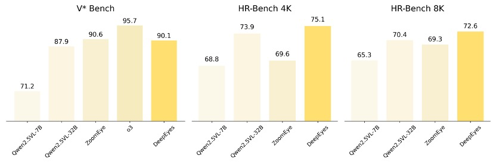
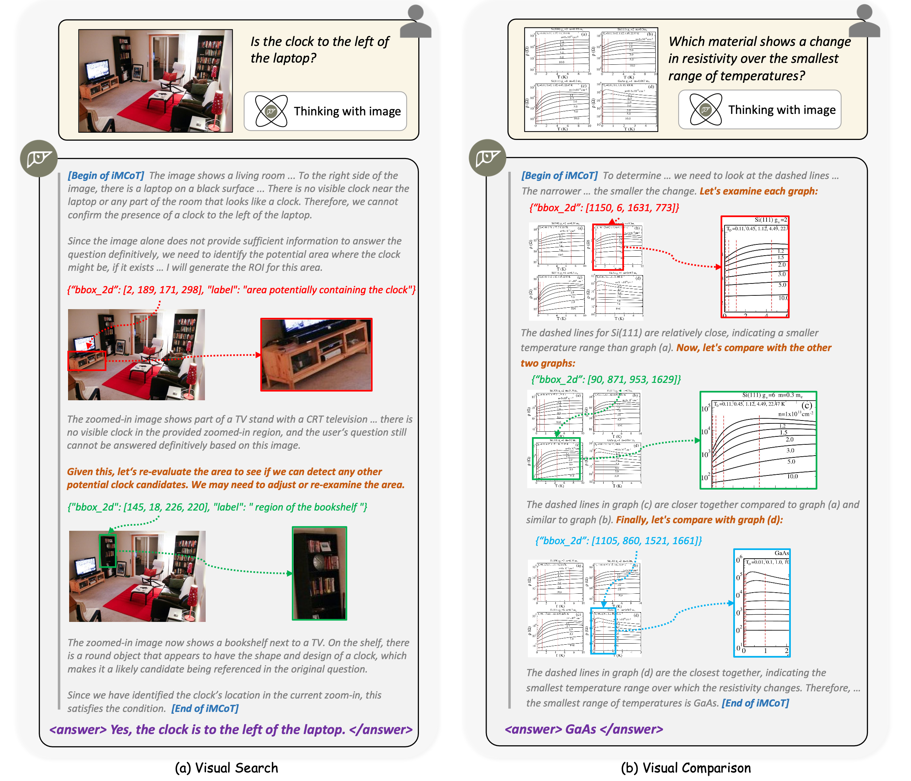

<div align="center">
  
  <span style="font-size: 32px; font-weight: bold;"> DeepEyes: Incentivizing “Thinking with Images” via Reinforcement Learning </span>

  <a href="xxx.xxx.xx">
    
  </a>
  <a href="xx.yy.zz">
    
  </a>
  <a href="xxx.yyy.zzz">
    
  </a>
</div>

## News
- [May 19th, 2025] Arxiv paper, code, dataset and checkpoint released.

## Key Insights
- The capability of DeepEyes to think with images is learned via end-to-end reinforcement learning. It is directly guided by outcome reward signals, requires NO cold-start or supervised fine-tuning, and does not rely on specialized external model.
- Although there is no direct supervision applied for intermediate steps, both the grounding IoU and tool-calling accuracy was increased during the RL training stage.

- The end-to-end RL training boosts performance significantly on high resolution benchmarks, and shows strong generalization for visual grounding, hallucination mitigation, and math problem solving tasks.

- We observed an emergence of thinking pattern during RL training process, such as visual search for small objects, visual comparisons across different regions, using `image_zoom_in_tools` for answer confirmation, etc.


##  Quick Start

### Environment Setup

```bash
# Follow the VeRL official installation procedure
pip install -e .

# Additional dependencies required by DeepEyes
bash scripts/install_deepeyes.sh
```

### Start Training

We use [Qwen-2.5-VL-7B-Instruct](https://huggingface.co/Qwen/Qwen2.5-VL-7B-Instruct) as our foundation model for RL training. [Qwen-2.5-VL-32B-Instruct](https://huggingface.co/Qwen/Qwen2.5-VL-32B-Instruct) is also supported.

We recommend using no less than 32 GPUs (4 nodes x 8 GPUs) for 7B training, and no less than 64 GPUs (8 nodes x 8 GPUs) for 32B training. For each node, we recommend using no less than 1200GB CPU RAM, as the high resolution images in V* and ArxivQA datasets can consume large amount of memory.

Step 1: Start a vllm serving of [Qwen-2.5-72B-Instruct](https://huggingface.co/Qwen/Qwen2.5-72B-Instruct) for llm-as-a-judge verification.

```bash
# download Qwen-2.5-72B-Instruct model
huggingface-cli download --resume-download https://huggingface.co/Qwen/Qwen2.5-72B-Instruct --local-dir /path/to/your/local/filedir --local-dir-use-symlinks False

# start vllm serving
vllm serve /path/to/your/local/filedir \
    --port 18901 \
    --gpu-memory-utilization 0.8 \
    --max-model-len 32768 \
    --tensor-parallel-size 8 \ 
    --served-model-name "judge" \
    --trust-remote-code \
    --disable-log-requests
```

Step 2: Build a ray cluster for all of the training nodes. Then use one of the following scripts to start training.

```bash
# your wandb access key here...
wandb login

# the IP and port for your Qwen-2.5-72B-Instruct vllm serving
export LLM_AS_A_JUDGE_BASE="http://your.vllm.machine.ip:18901/v1"

# config for 7B
bash examples/agent/final_merged_v1v8_thinklite.sh

# config for 32B
bash examples/agent/final_merged_v1v8_thinklite_32b.sh
```

The training scripts use both [wandb](https://wandb.ai/site/) and [RL Logging Board](https://github.com/HarderThenHarder/RLLoggingBoard) (great work) to visualize the training dynamics.

## Training on Customized Own Datasets or Tools

The code in this repository is a general agentic RL framework based on [VeRL](https://github.com/volcengine/verl), which is designed to fulfill the following needs:
- High efficient Agent RL training: Agent rollout is asynchronous among all data parallel groups.
- Allowing multi-modal input in agent observations: This is the key for the RL training of "thinking with images" ability.
- Allowing hybrid training for agent data with different tools and non-agentic data: Tool usage is not hard-coded in rollout loop, instead, each sample can specify its own tool usage constraint via `env_name` field.
- Compatible for algorithms: PPO, GRPO, and reinforce++ are supported. We modified the advantage estimation, as well as the policy loss masks, to make it compatible with the interleaved structure of Agentic RL (multi-turn RL) training.
- Compatible for latest VeRL updates: Unlike some previous agentic RL training framework that encapsulate VeRL as its submodule, we implement agent RL as a pluin

Therefore, it is possible to perform any form of general agentic RL training using our code implementation.

### Use your own data
Add an additional field `env_name` to your data parquet files. The `env_name` of each sample should specify the which tool is allowed to use when performing agent rollout. For non-agent training data, leave the `env_name` to None or empty string.

For DeepEyes style training, `env_name` should be specified as `visual_toolbox_v2`.

### Implement your own tools
Implement your tool function in a new class that inherents `ToolBase` class in [verl/workers/agent/tool_envs.py](verl/workers/agent/tool_envs.py) as its base class.

The subclass MUST include `name` variable, whose value corresponds to the `env_name` field in training data parquet files.

Implement the `execute` and `reset` functions. Refer to [verl/workers/agent/envs/mm_process_engine/visual_toolbox_v2.py](verl/workers/agent/envs/mm_process_engine/visual_toolbox_v2.py) as an examples.

### Using latest VeRL code

In case you want to use the latest VeRL code for training.

```bash
git remote add official https://github.com/volcengine/verl.git
git pull official main
```

## Citation
