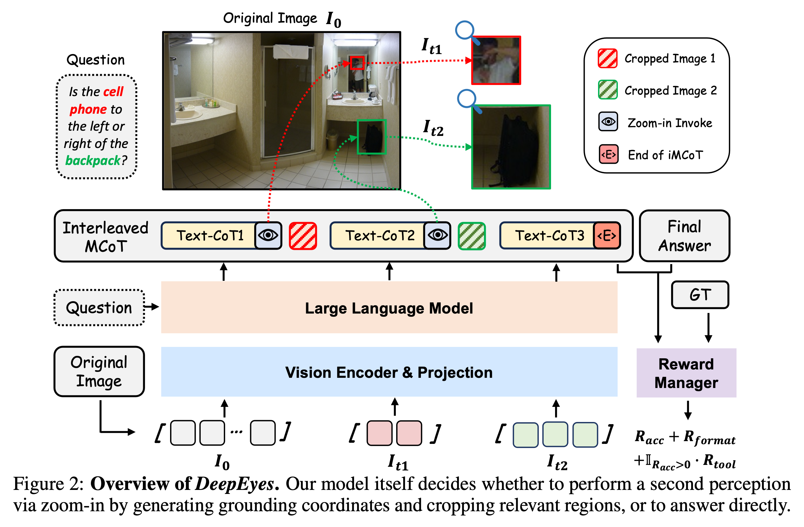
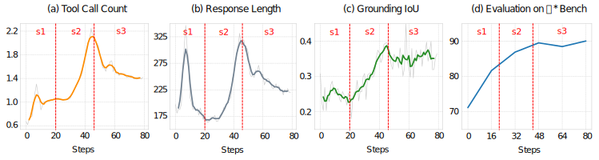
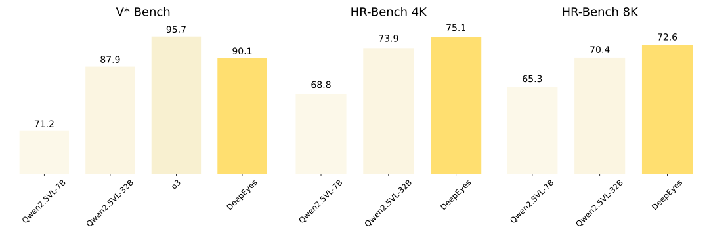
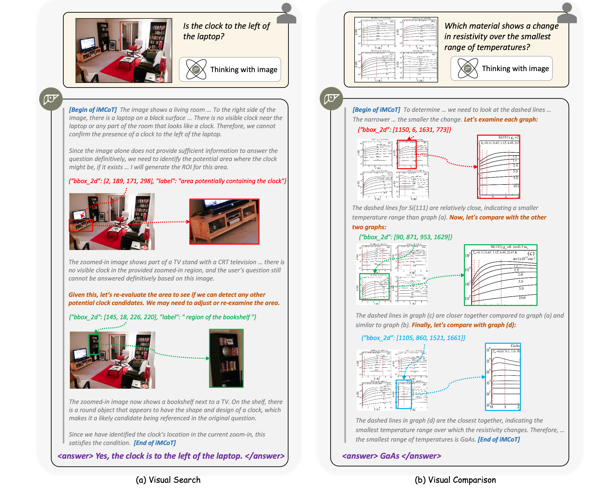

<div align="center">
  
  <h1 style="font-size: 32px; font-weight: bold;"> DeepEyes: Incentivizing “Thinking with Images” via Reinforcement Learning </h1>

  <br>

  <a href="https://arxiv.org/abs/2505.14362">
    
  </a>
  <a href="https://huggingface.co/datasets/ChenShawn/DeepEyes-Datasets-47k">
    
  </a>
  <a href="https://huggingface.co/ChenShawn/DeepEyes-7B">
    
  </a>
  <a href="https://visual-agent.github.io/">
    
  </a>
</div>

*\* Logo inspired by oracle bone character "eye".*

## DeepEyes
Quote from [https://openai.com/index/thinking-with-images/](https://openai.com/index/thinking-with-images/)
> They don’t just see an image, they can integrate visual information directly into the reasoning chain.



Key insights:
- The capability of DeepEyes to think with images is learned via end-to-end reinforcement learning. It is directly guided by outcome reward signals, requires no cold-start or supervised fine-tuning, and does not rely on specialized external model.
- Although there is no direct supervision applied for intermediate steps, both the grounding IoU and tool-calling accuracy was increased during the RL training stage.

- The end-to-end RL training yields significant performance gain on high resolution benchmarks, and shows strong generalization for visual grounding, hallucination mitigation, and math problem solving tasks.

- We observed an emergence of thinking pattern during RL training process, such as visual search for small objects, visual comparisons across different regions, using `image_zoom_in_tools` for answer verification, etc.


##  Quick Start

### Environment Setup

```bash
# Follow the VeRL official installation procedure
pip install -e .

# Additional dependencies required by DeepEyes
bash scripts/install_deepeyes.sh
```

### Start Training

We use [Qwen-2.5-VL-7B-Instruct](https://huggingface.co/Qwen/Qwen2.5-VL-7B-Instruct) as our foundation model for RL training. [Qwen-2.5-VL-32B-Instruct](https://huggingface.co/Qwen/Qwen2.5-VL-32B-Instruct) is also supported.

We recommend using no less than 32 GPUs (4 nodes x 8 GPUs) for 7B training, and no less than 64 GPUs (8 nodes x 8 GPUs) for 32B training. For each node, we recommend using no less than 1200GB CPU RAM, as the high resolution images in V* and ArxivQA datasets can consume large amount of memory.

Step 1: Start a vllm serving of [Qwen-2.5-72B-Instruct](https://huggingface.co/Qwen/Qwen2.5-72B-Instruct) for llm-as-a-judge verification.

```bash
# download Qwen-2.5-72B-Instruct model
huggingface-cli download --resume-download https://huggingface.co/Qwen/Qwen2.5-72B-Instruct --local-dir /path/to/your/local/filedir --local-dir-use-symlinks False

# start vllm serving
vllm serve /path/to/your/local/filedir \
    --port 18901 \
    --gpu-memory-utilization 0.8 \
    --max-model-len 32768 \
    --tensor-parallel-size 8 \ 
    --served-model-name "judge" \
    --trust-remote-code \
    --disable-log-requests
```

Step 2: Build a ray cluster for all of the training nodes. Prepare data before starting training. Our training dataset can be downloaded from [huggingface](https://huggingface.co/datasets/ChenShawn/DeepEyes-Datasets-47k).


Step 3: Use one of the following scripts to start training.

```bash
# your wandb access key here...
wandb login

# the IP and port for your Qwen-2.5-72B-Instruct vllm serving
export LLM_AS_A_JUDGE_BASE="http://your.vllm.machine.ip:18901/v1"

# umber of training nodes
export WORLD_SIZE=8

# config for 7B
bash examples/agent/final_merged_v1v8_thinklite.sh

# config for 32B
bash examples/agent/final_merged_v1v8_thinklite_32b.sh
```

The training scripts use both [wandb](https://wandb.ai/site/) and [RL Logging Board](https://github.com/HarderThenHarder/RLLoggingBoard) (great work) to visualize the training dynamics.

## Programming Guide

<details>
<summary>General Introduction for Codes</summary>

### General Introduction

The code in this repository is a general agentic RL training framework based on [VeRL](https://github.com/volcengine/verl). Apart from DeepEyes, it is possible to perform any form of general agentic RL (multi-turn RL) training using our code implementation.

The code is designed to fulfill the following needs:
- **High efficient Agent RL training**: Agent rollout is asynchronous among all data parallel groups.
- **Allowing dynamic multi-modal input in agent observations**: This is the key for the RL training of "thinking with images" ability.
- **Allowing hybrid training for agent data with different tools and non-agentic data**: Tool usage is not hard-coded in rollout loop, instead, each sample can specify its own tool usage constraint via `env_name` field.
- **Support for algorithm**: PPO, GRPO, and reinforce++ are supported. We modified the advantage estimation, the policy loss masks, as well as the mrope for Qwen-VL models, to make it compatible with the interleaved structure of agentic multi-turn RL training.
- **Compatible for latest VeRL updates**: agentic RL training is implemented as a plugin for VeRL, making it easy to merge with the latest VeRL updates. Once you turn off the plugin switch, the functionality will be no different to the original version of VeRL.

</details>

<details>
<summary>Code Navigation</summary>

Reproduction code for our [DeepEyes](https://arxiv.org/abs/2505.14362).
- Training script: [examples/agent/final_merged_v1v8_thinklite.sh](examples/agent/final_merged_v1v8_thinklite.sh)
- Tool definition: [verl/workers/agent/envs/mm_process_engine/visual_toolbox_v2.py]
(verl/workers/agent/envs/mm_process_engine/visual_toolbox_v2.py)
- Reward definition: [verl/utils/reward_score/vl_agent.py](verl/utils/reward_score/vl_agent.py)

Reproduction code for [R1-Searcher](https://github.com/RUCAIBox/R1-Searcher) using PPO.
- Training script: [examples/agent/train_ppo_rag_v2.sh](examples/agent/train_ppo_rag_v2.sh)
- Tool definition: [verl/workers/agent/envs/rag_engine/rag_engine_v2.py](verl/workers/agent/envs/rag_engine/rag_engine_v2.py)
- Reward definition: [verl/utils/reward_score/agent.py](verl/utils/reward_score/agent.py)

</details>

<details>
<summary>Training on Customized Datasets</summary>

### Use your own data
Add an additional field `env_name` to your data parquet files. The `env_name` of each sample should specify the which tool is allowed to use when performing agent rollout. For non-agent training data, leave the `env_name` to None or empty string.

For DeepEyes style training, for example, `env_name` should be specified as `visual_toolbox_v2`.

The rest part is no different to the original VeRL dataset format. Refer to [VeRL official documentation](https://verl.readthedocs.io/en/latest/index.html) for details.

</details>

<details>
<summary>Training with Customized Tools</summary>

### Implement your own tools
Implement your tool function in a new class that inherents `ToolBase` class in [verl/workers/agent/tool_envs.py](verl/workers/agent/tool_envs.py) as its base class.

The subclass MUST include `name` variable, whose value corresponds to the `env_name` field in training data parquet files.

Implement the `execute` and `reset` functions. Here is an simple example:

Example code:
```python
class CustomTool(ToolBase):
    name = "custom_tool_v0"

    def __init__(self, _name, _desc, _params, **kwargs):
        super().__init__(name=self.name)

    def execute(self, action_string: str, **kwargs) -> tuple:
        """
        Execute the tool functionality based on the LLM generated text.
        This function is called EACH TIME after vllm.generate
        
        Args:
            action_string: The string generated by LLM via vllm.generate.

        Returns:
            observation: The structured observation with the processed image.
            reward: setting a non-zero value if you want to assign a reward to the LAST GENERATED TOKEN in the intermediate steps.
            done: Whether the episode is terminated.
            info: Additional info.
        """
        pass

    def reset(self, raw_prompt, multi_modal_data, origin_multi_modal_data, **kwargs):
        """
        This function is called ONLY ONCE when initializing the tools

        Args:
            raw_prompt: setting config param `data.return_raw_chat=True` to get raw prompt input.
            multi_modal_data: refer to vllm documentation for details https://docs.vllm.ai/en/stable/features/multimodal_inputs.html
            origin_multi_modal_data: VLM vision processor can modify the original images, typically by resizing, when they are too small or too large, use this param if you want to get access to the unmodified vision input.
        """
        pass
```

Refer to [verl/workers/agent/envs/mm_process_engine/visual_toolbox_v2.py](verl/workers/agent/envs/mm_process_engine/visual_toolbox_v2.py) as an example for the `image_zoom_in_tool` in DeepEyes.

**Important**: Import your custom tool in [verl/workers/agent/__init__.py](verl/workers/agent/__init__.py)

```python
from .envs.your_custom_tool import CustomTool
```

</details>

<details>
<summary>Using latest VeRL code</summary>

### Using latest VeRL code
In case you want to use the latest VeRL code for training.

```bash
git remote add official https://github.com/volcengine/verl.git
git pull official main
```

</details>

## Licence

This project is released under [Apache licence](./LICENSE).

## Citation

```
@article{zheng2025deepeyesincentivizingthinkingimages,
    title={DeepEyes: Incentivizing "Thinking with Images" via Reinforcement Learning}, 
    author={Ziwei Zheng, Michael Yang, Jack Hong, Chenxiao Zhao, Guohai Xu, Le Yang, Chao Shen, Xing Yu},
    year={2025},
    eprint={2505.14362},
    archivePrefix={arXiv},
    primaryClass={cs.CV},
    url={https://arxiv.org/abs/2505.14362}, 
}
```